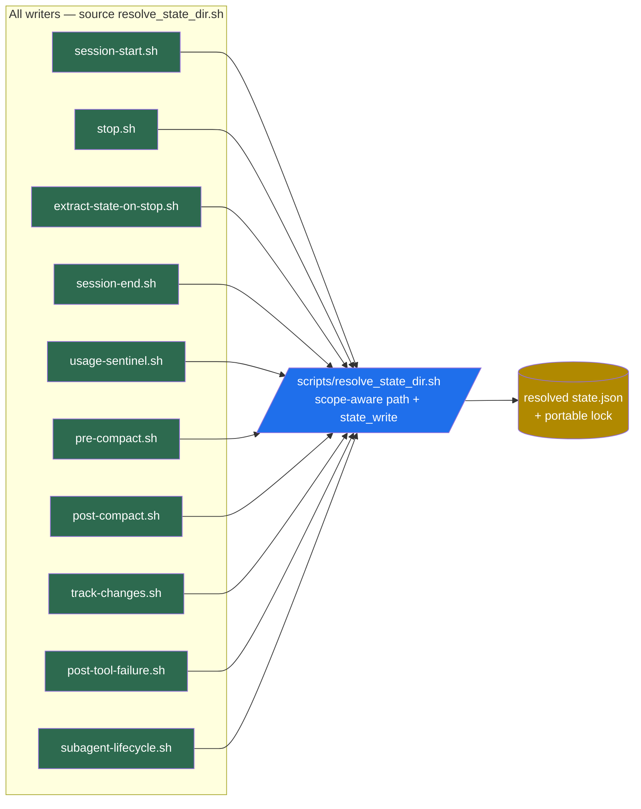
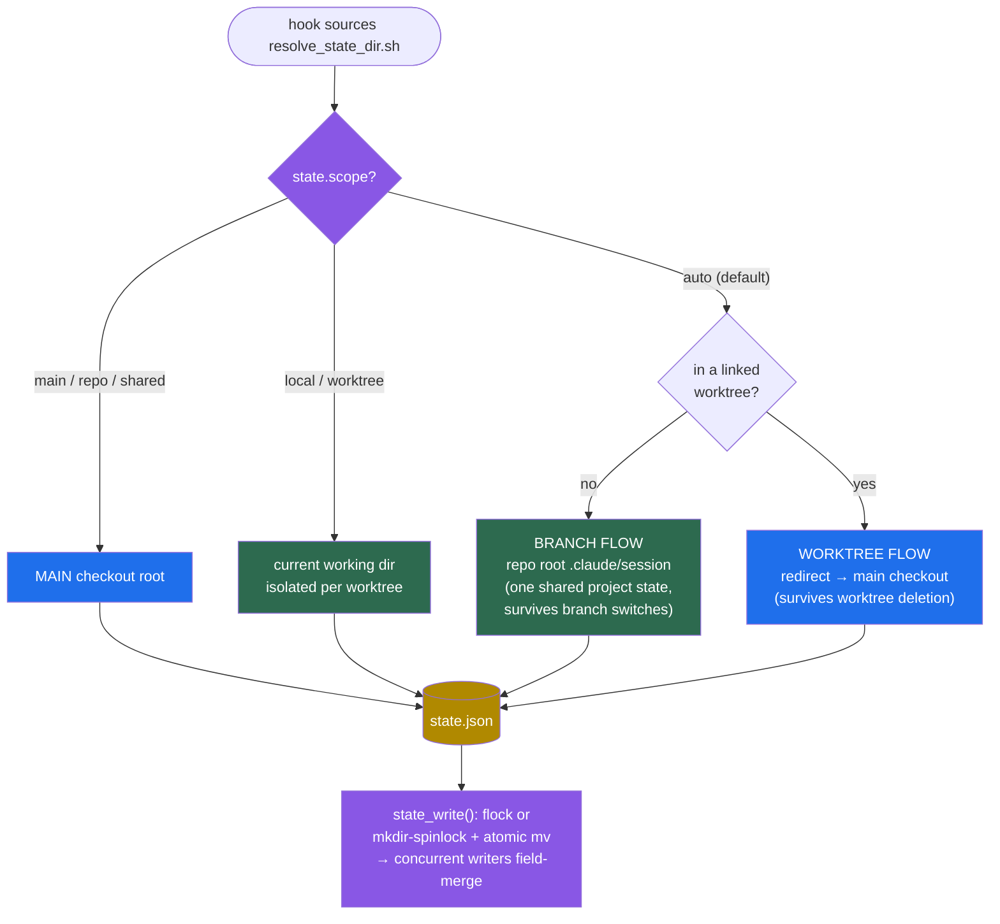
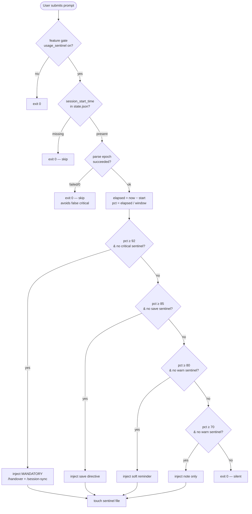
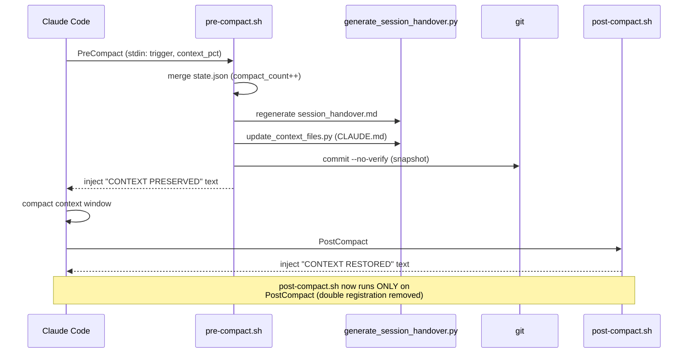
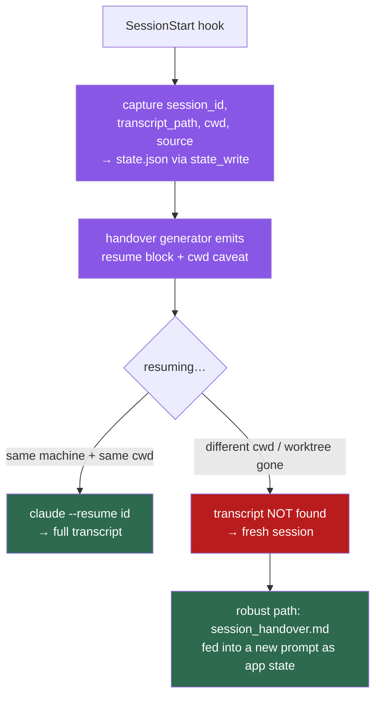
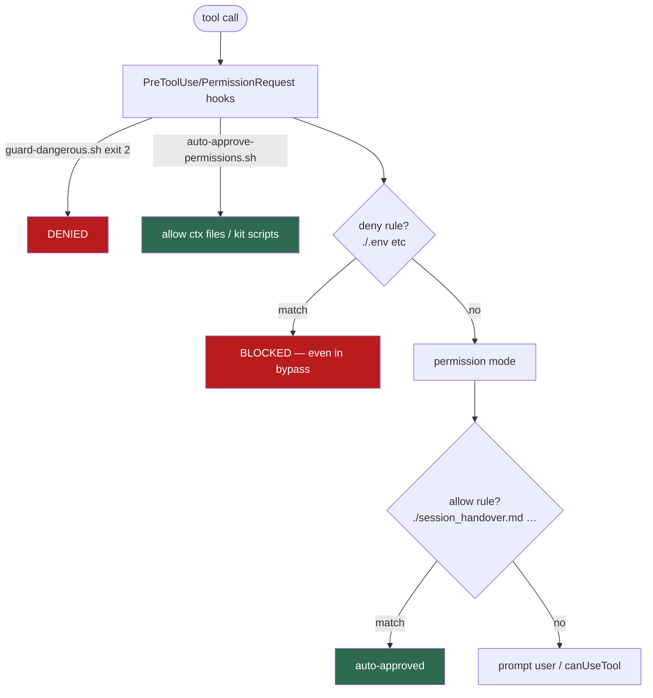
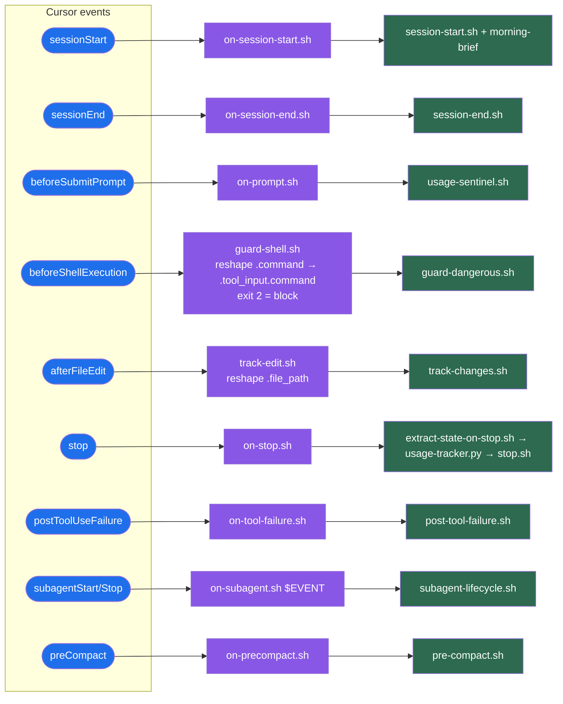

# Hooks & Triggers — Visual Logic Map

> Rendered Mermaid diagrams. Edit the blocks below to change the wiring, then
> mirror the change into `.claude/settings.json` (Claude Code) **and**
> `.cursor/hooks.json` (Cursor) and the relevant hook script.

> **Runtimes:** the kit's logic lives in `.claude/hooks/*.sh`. Two runtimes
> dispatch to it:
> - **Claude Code** — events wired in `.claude/settings.json` (project) and
>   `hooks/hooks.json` (plugin). Scripts read Claude Code's stdin JSON directly.
> - **Cursor** — events wired in `.cursor/hooks.json`; thin adapters in
>   `.cursor/hooks/*.sh` translate Cursor's payloads into the Claude Code shape
>   and exec the same underlying scripts. See §7.
>
> **Removed (do not re-add):** `InstructionsLoaded` and `ConfigChange` are NOT
> real Claude Code events (not in the [hooks reference](https://code.claude.com/docs/en/hooks)),
> so those entries never fired and were deleted from both configs.

---

## 1. Event → Hook wiring (from `.claude/settings.json`)

This is the dispatch table. Each Claude Code event fans out to one or more
hook scripts. `async` hooks do **not** block the turn.

```mermaid
flowchart TD
    classDef sync fill:#1f6feb,color:#fff,stroke:#0b3d91
    classDef async fill:#8957e5,color:#fff,stroke:#4b2a86
    classDef inline fill:#2d6a4f,color:#fff,stroke:#1b4332
    classDef state fill:#b08900,color:#fff,stroke:#7a5c00

    SS([SessionStart]):::sync
    UPS([UserPromptSubmit]):::sync
    PRE([PreCompact]):::sync
    POST([PostCompact]):::sync
    STOP([Stop]):::sync
    END([SessionEnd]):::sync
    PRT([PreToolUse: Bash]):::sync
    PTU([PostToolUse: Edit/Write]):::sync
    PTF([PostToolUseFailure]):::sync
    SAS([SubagentStart]):::sync
    SAP([SubagentStop]):::sync
    PR([PermissionRequest: Write/Edit]):::sync
    NOTE([Notification]):::sync
    CFG([ConfigChange]):::sync

    SS --> ss[session-start.sh]:::sync
    SS --> mb[morning-brief-auto.sh<br/>async]:::async
    SS -- "matcher: compact" --> pc1[post-compact.sh]:::sync

    UPS --> us[usage-sentinel.sh<br/>sync, blocking]:::sync

    PRE --> pcs[pre-compact.sh]:::sync
    POST --> pc2[post-compact.sh]:::sync

    STOP --> es[extract-state-on-stop.sh<br/>async]:::async
    STOP --> ut[usage-tracker.py<br/>async]:::async
    STOP --> st[stop.sh<br/>sync]:::sync

    END --> se[session-end.sh]:::sync
    PRT --> gd[guard-dangerous.sh]:::sync
    PTU --> tc[track-changes.sh]:::sync
    PTF --> ptf[post-tool-failure.sh<br/>async]:::async
    SAS --> sl1[subagent-lifecycle.sh<br/>async]:::async
    SAP --> sl2[subagent-lifecycle.sh<br/>async]:::async
    PR --> ap[auto-approve-permissions.sh]:::sync
    NOTE --> nt[notify.sh]:::sync
    CFG --> ca[jq → config-audit.log]:::inline
```

---

## 2. State file flow — who writes `state.json`

`state.json` is the spine. **Fixed:** all ten writers now resolve their path
through the shared `scripts/resolve_state_dir.sh` helper, so they converge on
a single `state.json` on the MAIN checkout — no more worktree divergence.

---

## 2a. Branch flow vs. worktree flow (configurable)

`config/plugin_settings.json → state.scope` selects how state is located.
Branch users (no worktrees) and worktree users get distinct, explicit paths.

**Pick your mode:**

| `state.scope` | Branch user (no worktrees) | Worktree user |
|---|---|---|
| `auto` *(default)* | repo root — one shared project state | redirect to main checkout |
| `main` (`repo`, `shared`) | repo root (same thing) | main checkout — cross-worktree continuity |
| `local` (`worktree`) | repo root (same thing) | isolated per-worktree state |

If you don't use worktrees, every mode behaves identically (repo-root,
one shared state) — you can ignore the setting entirely. The knob only
matters once linked worktrees enter the picture.

---

## 3. Usage-sentinel decision tree (`UserPromptSubmit`)

This is the logic that fired the "USAGE CRITICAL" banner at the top of this
session.

> Sentinels are cleared by `session-start.sh` so each new session re-arms the
> warnings. **Design caveat:** `session_start_time` is reset on *every*
> SessionStart (fresh *and* resumed), so this measures wall-clock since the
> last session start — not the real rolling Pro/Max usage window. It can both
> over- and under-report.

---

## 4. Compaction lifecycle

---

## 5. Session resume — Agent SDK alignment

Per [code.claude.com/docs/en/agent-sdk/sessions](https://code.claude.com/docs/en/agent-sdk/sessions),
the SDK/CLI persists each conversation transcript to
`~/.claude/projects/<encoded-cwd>/<session-id>.jsonl`, where `<encoded-cwd>`
is the absolute working directory with every non-alphanumeric character
replaced by `-`. **Resume is cwd-bound.**

This is the SDK-level analogue of the worktree state divergence we fixed: a
session started in a worktree is keyed by the *worktree's* path, so
`claude --resume <id>` from `main` (or after the worktree is deleted) silently
starts a fresh session.

The kit's design already matched the SDK's own recommendation ("capture the
results you need as application state and pass them into a fresh session's
prompt … more robust than shipping transcript files around") — that *is*
`session_handover.md`. Applied on top: the SessionStart/Stop hooks now record
`session_id` / `transcript_path` / `session_cwd`, and the handover's **Commands
to Resume** section prints the exact `--resume` command plus the cwd caveat.

---

## 6. Permission handling — audit vs. Agent SDK docs

Checked against [permissions](https://code.claude.com/docs/en/agent-sdk/permissions),
[hooks](https://code.claude.com/docs/en/agent-sdk/hooks) and
[settings](https://code.claude.com/docs/en/settings).

**SDK evaluation order:** `Hooks → Deny rules → Permission mode → Allow rules
→ canUseTool`. A hook returning `allow` does **not** bypass deny rules; a
matching `deny` blocks even under `bypassPermissions`. settings.json rules are
evaluated `deny → ask → allow`, first match wins.

**What was already correct:** declarative `permissions.allow`/`deny` is the
doc-blessed mechanism and was present; `guard-dangerous.sh` denying via
`exit 2` on `PreToolUse` is correct; the `.env` deny holds regardless of the
auto-approve hook because deny is evaluated independently of hook `allow`.

**Issues found & fixed:**

| Issue | Severity | Fix |
|---|---|---|
| File rules lacked the canonical `./` path anchor (`Read(.env)` vs documented `Read(./.env)`) — deny rules for `.env` and allow rules for context files likely **never matched**, so the kit's "never prompt / never read .env" promise wasn't actually enforced by settings. | High | All `Read`/`Write`/`Edit` rules re-anchored to `./` form per the settings doc's own examples. |
| `Bash(git commit -m chore(context)*)` — parentheses in the specifier; never matches real quoted commit commands. | Medium | Removed. Context commits run as raw shell *inside hooks*, which bypass the Bash-tool permission system entirely, so no allow rule is needed. Not broadened to `git commit *` (would dangerously auto-approve arbitrary commits). |
| `auto-approve-permissions.sh` hardcoded `hookEventName: "PermissionRequest"`; if fired as `PreToolUse` the decision is ignored ("include hookEventName to identify which hook type the output is for"). | Medium | Now echoes back the incoming `hook_event_name`; output emitted via `jq` so it's valid for either event. |
| PermissionRequest matcher was `Write|Edit|MultiEdit`, so the script's carefully injection-hardened **Bash allow-list branch was dead code**. | Low | Matcher broadened to `…|Bash` so the kit-script allow-list (metachar-rejecting, anchored) is live as defense-in-depth alongside the declarative `Bash()` rules. |

**Verified:** context-file writes auto-approve under both `PermissionRequest`
and `PreToolUse` (event echoed correctly); non-context writes and arbitrary /
metachar-smuggled Bash fall through to a normal prompt; a `.env` write is
**not** approved by the hook (the deny rule owns that, by SDK design).

---

## 7. Cursor runtime support (`.cursor/hooks.json`)

Cursor uses a different event model and stdin schema than Claude Code, so the
kit ships thin adapters in `.cursor/hooks/*.sh`. Each adapter exports
`CLAUDE_PROJECT_DIR`/`CLAUDE_PLUGIN_ROOT` (resolved from its own location),
reshapes Cursor's payload into the Claude Code shape where field names differ,
and execs the **same** underlying `.claude/hooks/*.sh` — one logic core, two
runtimes. Banner/injection stdout is routed to stderr (the Hooks output
channel) since Cursor does not inject arbitrary hook stdout as context; the
load-bearing side effects (state writes, git snapshot, guards) still run.

**Field reshape needed** (Cursor top-level → Claude Code nested):
`beforeShellExecution.command → tool_input.command`,
`afterFileEdit.file_path → tool_input.file_path`. Other scripts default missing
fields gracefully, so their adapters pass the payload through unchanged.

**Cursor has no equivalent for** `PostCompact` (re-injection) or
`PermissionRequest` (auto-approve) — those Claude Code behaviors are intentionally
not mapped. Dangerous-command blocking instead rides `beforeShellExecution`
(exit code 2 = deny).

**De-dupe:** since v3.0.0 the plugin manifest `hooks/hooks.json` is the single
hook source — the repo's `.claude/settings.json` declares no hooks, so the old
plugin+repo double fire (previously papered over by a `hook_once` guard) cannot
occur.

---

## Code review findings — all resolved

### High — worktree state divergence ✅ FIXED

Was: five hooks redirected `state.json` to the main checkout, five used the
worktree path, so state silently diverged in worktrees.

Fix shipped: extracted the copy-pasted worktree-detection block into
`scripts/resolve_state_dir.sh`. All ten hooks now source it and converge on a
single MAIN `state.json`. Verified from this worktree:
`MAIN_ROOT` resolves to the main checkout, not the worktree.

### High — concurrent `state.json` writes on `Stop` ✅ FIXED

Was: `extract-state-on-stop.sh` (async), `usage-tracker.py` (async), and
`stop.sh` (sync) raced on `state.json`, losing updates.

Fix shipped: consolidated into a single `Stop` entry in `settings.json` with a
sequential `hooks` array and `async` removed, so the three run in order with
no overlap. Additionally, **all** read-modify-write hooks now go through
`state_write()` in `resolve_state_dir.sh`, which takes a portable lock (flock
where available, `mkdir`-spinlock fallback for macOS) and writes atomically —
so even cross-worktree / cross-session concurrent writers field-merge instead
of clobbering. Verified: 50 parallel increments land all 50; a corrupt
`state.json` is recovered to `{}` rather than wedging the hook.

### Medium — `post-compact.sh` double registration ✅ FIXED

Removed the `SessionStart`(matcher `compact`) entry. `post-compact.sh` now
fires only on `PostCompact`.

### Medium — `session-end.sh` drops worktree `CLAUDE.md` ✅ FIXED

`session-end.sh` now copies the worktree's `CLAUDE.md` into main alongside the
session dir and handover before committing.

### Low — heuristic `next_action` thrash ✅ FIXED

`extract-state-on-stop.sh` now guards `next_action` the same way as
`active_task`: it only fills it when the stored value is empty or a generic
placeholder, so a precise `next_action` from `/handover` is never clobbered.

### Low — `guard-dangerous.sh` regex gaps ✅ FIXED

Added patterns for separate `-r -f` flags (any order), quoted destructive
targets (`"$HOME"`, `'~'`, `"/"`), and bare current-dir wipes (`rm -rf .`,
`rm -rf ./`). Verified: `rm -rf ./build` and `git status` still pass; `rm -rf .`,
`rm -rf "$HOME"`, `rm -r -f /`, `git push --force … main`, `git clean -fd` all
block. It remains defense-in-depth — a regex guard is a speed bump, not a wall.
